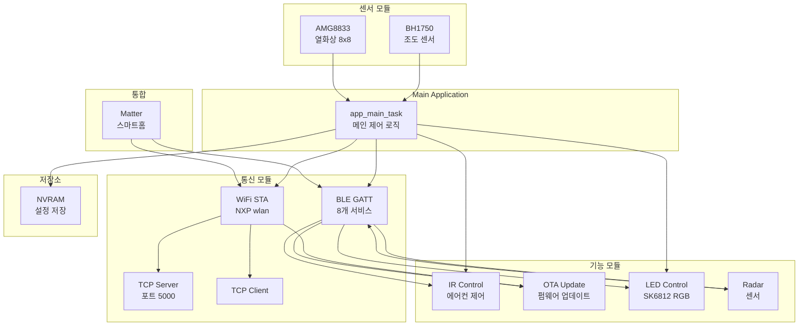

# zCube 모듈 구성 요약

## 📊 시스템 아키텍처 다이어그램



## 🎯 주요 모듈 기능 요약

### 1️⃣ BLE (Bluetooth Low Energy)
- **디바이스명**: zCube
- **서비스 개수**: 8개
- **주요 기능**:
  - 📊 상태 보고 (WiFi, TCP, 센서)
  - 🎮 제어 명령 (재부팅, 초기화, 재연결)
  - ⚙️ 프로비저닝 (WiFi/TCP 설정)
  - 🌡️ IR 에어컨 제어
  - 📡 레이더 데이터
  - 🔄 OTA 업데이트
  - 💡 LED 제어
  - 🏠 Matter 통합

### 2️⃣ WiFi
- **모드**: STA (클라이언트)
- **보안**: OPEN, WPA2
- **DHCP**: 자동 IP 할당
- **이벤트**: 연결/해제/실패 콜백

### 3️⃣ TCP/IP
- **서버**: 단일 클라이언트, 포트 5000
- **클라이언트**: 자동 재연결
- **스택**: lwIP
- **의존성**: WiFi 연결 필수

### 4️⃣ OTA (펌웨어 업데이트)
- **전송**: BLE 또는 HTTP
- **플래시**: Dual-slot (slot0/slot1)
- **프로토콜**: begin → chunk → commit → reboot
- **검증**: 부트로더에서 수행

### 5️⃣ IR (적외선)
- **지원**: 삼성 에어컨 (완전 구현)
- **명령**: 전원, 온도 조절 (16-30°C)
- **하드웨어**: CTIMER (38kHz 캐리어)
- **향후**: LG, 캐리어, 위니아 등

### 6️⃣ 센서
- **BH1750**: 조도 센서 (1-65535 lux)
- **AMG8833**: 열화상 8x8 픽셀 (0-80°C)
- **I2C**: 공유 버스 (뮤텍스 동기화)

### 7️⃣ LED
- **타입**: SK6812 RGBW
- **인터페이스**: SPI
- **패턴**: 고정, 깜빡임, 호흡, 무지개, 수면등

### 8️⃣ Radar
- **통신**: UART
- **용도**: 움직임 감지
- **출력**: BLE로 실시간 스트리밍

### 9️⃣ NVRAM
- **저장**: WiFi/TCP 설정
- **포맷**: 구조체 (SSID, 비밀번호, IP, 포트)
- **관리**: 로드/저장/초기화

### 🔟 Matter
- **프로토콜**: Matter 스마트홈 표준
- **역할**: BLE/WiFi 브릿지
- **디바이스**: 조명, 센서 등

---

## 🔄 멀티태스킹 구조

### 현재: FreeRTOS + Zephyr 혼합

```
Zephyr Kernel
├── app_main_task (K_THREAD_DEFINE) ← 메인
├── BLE Stack (Zephyr BT) ← 자동
└── FreeRTOS 태스크들:
    ├── zcube_tcps (TCP Server)
    ├── zcube_tcp (TCP Client)
    ├── zcube_lux (조도 센서)
    ├── zcube_amg (열화상)
    ├── zcube_radar (레이더)
    ├── ota_http (HTTP OTA)
    └── ota_reboot (재부팅)
```

### 태스크 우선순위 권장

```
0-2:  실시간 (인터럽트 레벨)
3-5:  높음 (센서, 통신)
  3:  TCP Server/Client
  5:  app_main_task
6-8:  중간 (BLE, LED)
9-14: 낮음 (로깅, 백그라운드)
```

---

## 🔧 주요 API 한눈에 보기

### WiFi
```c
app_wifi_init(callback, arg);
app_wifi_connect(nvram_cfg);
app_wifi_disconnect();
app_wifi_is_connected();
```

### TCP Server
```c
app_tcp_server_start(port, rx_callback, arg);
app_tcp_server_send(data, len);
app_tcp_server_stop();
app_tcp_server_is_client_connected();
```

### TCP Client
```c
app_tcp_client_start(nvram_cfg, rx_callback, arg);
app_tcp_client_send(data, len);
app_tcp_client_stop();
app_tcp_client_is_connected();
```

### OTA
```c
app_ota_init(status_callback, arg);
app_ota_begin(total_size);
app_ota_chunk(offset, data, len);
app_ota_commit(header, header_len);
app_ota_abort();
app_ota_reboot_after_ms(delay);
```

### IR
```c
ir_aircon_init();
ir_aircon_send(brand, action);
ir_aircon_set_temp_c(brand, temp);
ir_aircon_get_temp_c(brand);
```

### LED
```c
led_task_start();
led_task_set_pattern(pattern, color);
led_task_set_color(color);
led_task_set_brightness(brightness);
led_task_set_pixel(index, color);
```

### NVRAM
```c
app_nvram_init();
app_nvram_load(&cfg);
app_nvram_save(&cfg);
app_nvram_factory_reset();
```

---

## 📁 디렉토리 구조

```
frdm_rw612_blank/
├── src/
│   └── main.c                    # Zephyr 메인 (K_THREAD_DEFINE)
├── app/
│   ├── app_main_zephyr.c         # 애플리케이션 메인
│   ├── ble/
│   │   ├── gatt_servers/         # 8개 GATT 서비스
│   │   └── zephyr_bt_rand_shim.c
│   ├── wifi/                     # WiFi STA
│   ├── tcp/                      # TCP 서버/클라이언트
│   ├── ota/                      # OTA 업데이트
│   ├── ir/                       # IR 에어컨 제어
│   ├── leds/                     # LED 제어
│   ├── sensors/                  # BH1750, AMG8833
│   ├── radar/                    # 레이더
│   ├── nvm/                      # NVRAM 설정
│   └── .matter/                  # Matter 통합
├── boards/                       # 보드 설정
├── debug/                        # 빌드 출력 (Debug)
├── CMakeLists.txt               # 빌드 설정
├── prj.conf                     # Zephyr 설정
└── west.yml                     # West manifest
```

---

## 🔌 하드웨어 연결

### FRDM-RW612 핀 맵
- **BLE/WiFi**: 내장 (RW612)
- **I2C**: BH1750, AMG8833
- **SPI**: SK6812 LED
- **UART**: Radar 센서
- **CTIMER**: IR LED (38kHz PWM)
- **GPIO**: LED0 (상태 표시)

---

## ⚡ 전원 관리

### 절전 모드
- **WiFi 연결 해제 시**: 저전력 모드
- **BLE만 활성화**: 전력 절약
- **센서**: 주기적 읽기 (슬립 가능)

---

## 🐛 디버깅 팁

### 로그 활성화
```conf
CONFIG_LOG=y
CONFIG_LOG_DEFAULT_LEVEL=3  # INF
CONFIG_BT_DEBUG_LOG=y
```

### MCUXpresso IDE
- **디버거**: J-Link
- **브레이크포인트**: 각 모듈 init 함수
- **변수 모니터**: 상태 변수 확인

### Shell (선택 사항)
```conf
CONFIG_SHELL=y
CONFIG_BT_SHELL=y
```

---

## 📝 TODO / 향후 계획

### 단기
- [ ] WiFi → Zephyr 네이티브 API 포팅
- [ ] TCP → Zephyr 소켓 포팅
- [ ] 센서 태스크 → Zephyr 스레드 변환
- [ ] 동기화 → Zephyr 프리미티브

### 중기
- [ ] LG/캐리어 IR 코덱 구현
- [ ] Matter 완전 통합
- [ ] 전력 관리 최적화

### 장기
- [ ] Zigbee 추가
- [ ] Thread 프로토콜
- [ ] 클라우드 연동

---

## 📚 관련 문서

- **[MODULE_ARCHITECTURE.md](MODULE_ARCHITECTURE.md)** - 상세 아키텍처 (이 파일보다 더 자세함)
- **[MULTITASKING_GUIDE.md](MULTITASKING_GUIDE.md)** - Zephyr 멀티태스킹 가이드
- **[MCUXPRESSO_SETUP.md](MCUXPRESSO_SETUP.md)** - IDE 설정
- **[README.rst](README.rst)** - 프로젝트 개요

---

**업데이트**: 2026-05-24  
**버전**: 1.0  
**상태**: ✅ 문서화 완료
